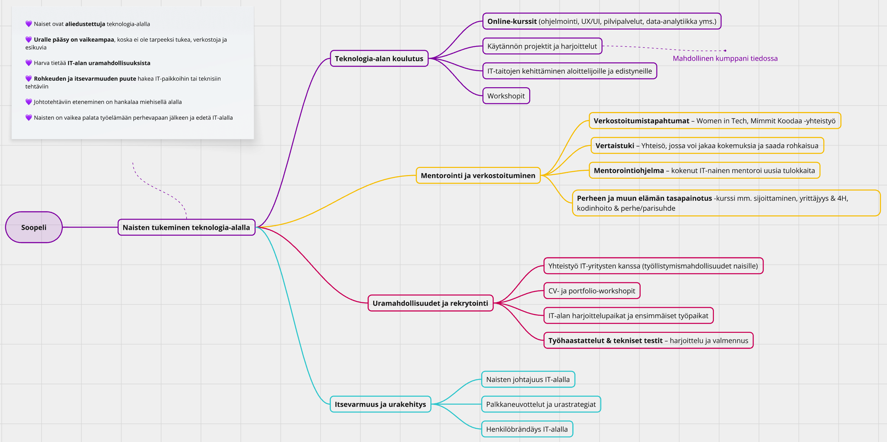
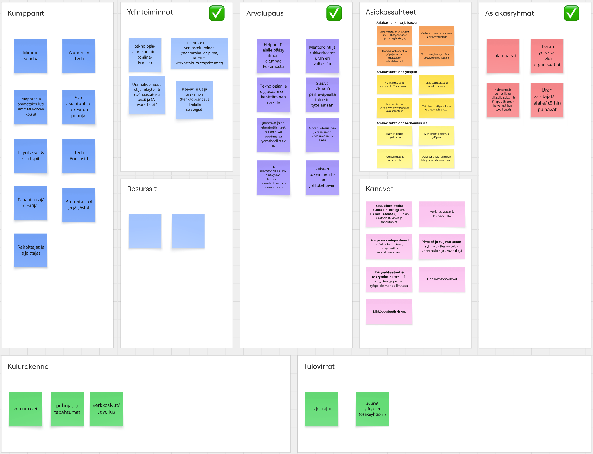

# Project Soopeli – Tech-Based Social Business Concept
2025  
**Tech-based social business concept** focused on empowering women in tech through mentorship, learning, and career growth.

This concept was developed during the **Social Business Academy**, a Finnish–Latvian training program focused on social entrepreneurship, and was pitched in **Tallinn, Estonia**.

My role focused on **Tech & Design**, including digital platform thinking, service structure, and supporting the pitch materials.

## Overview
Women face barriers in entering, staying, and growing in the tech industry, often due to: 

💜 Limited access to mentors, networks, and visible role models  
💜 Challenges related to career growth, retention, and re-entry  
💜 Lack of structured and accessible support systems  

## Key Concept Features
💜 Mentorship and networking opportunities  
💜 Learning resources and upskilling support  
💜 Career growth and re-entry guidance  
💜 Supportive and inclusive tech-focused community  

## Platform Logic & User Flow
High-level view of how the platform would work:

1️⃣ **Sign up & choose a path** (mentorship, career re-entry, or skill development)  
2️⃣ **Get matched** with mentors and relevant learning resources  
3️⃣ **Engage & learn** through sessions, events, and content  
4️⃣ **Progress** toward career growth and returning to tech  

🔗 [Pitch deck & presentation preview (Figma)](https://www.figma.com/deck/BnMEGF0lV39QhaLmX6LPxt/Soopeli-pitch)  

Visual snapshots from the planning and concept development stage:

## My Role – Tech & Design
💜 Co-developed the concept together with a friend  
💜 Designed the digital platform and service flow logic  
💜 Contributed to visual direction and landing page concept  
💜 Prepared and presented the pitch in Tallinn  

## Business & Sustainability Thinking
💜 Partnerships and sponsorships  
💜 Corporate training and workshops  
💜 Grants and public funding opportunities  
💜 Consulting and affiliate-based models  

## Tools & Methods
💜 Figma - Pitch deck and platform concept  
💜 Miro - Service design and business model canvas  
💜 Miro - Collaborative planning (Kanban-style workflow)  
💜 Pitching and presentation skills  

## Materials
🔗 [Pitch deck & presentation preview (Figma)](https://www.figma.com/deck/BnMEGF0lV39QhaLmX6LPxt/Soopeli-pitch)  
🔗 Planning materials: available in `/planning/`  
🔗 [Central Baltic Programme article](https://centralbaltic.eu/project-news/from-self-doubt-to-confidence/)  
🔗 [LinkedIn reflection post](https://www.linkedin.com/feed/update/urn:li:activity:7308387013542432768/)  

## What I Learned
💜 Translating a social challenge into a structured digital service concept  
💜 Designing service flows before technical implementation  
💜 Communicating ideas clearly in an international, collaborative setting  
